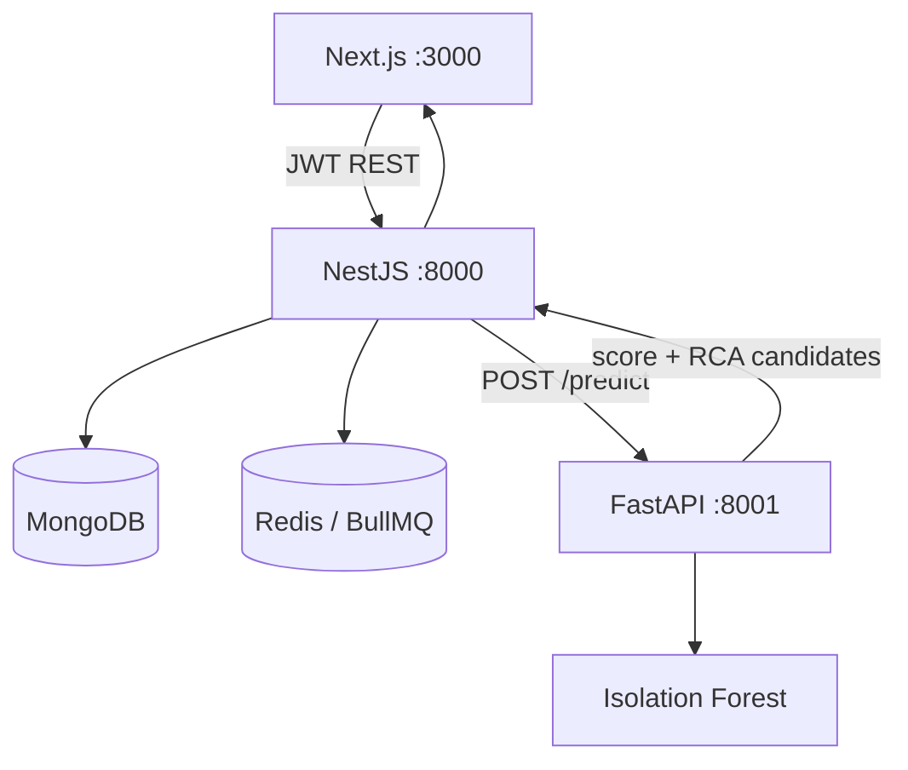

# SentinelOps API

AI-Based Incident Detection and Automated Root Cause Analysis Platform for Distributed Enterprise Applications.

**Base URL:** `http://localhost:8000/api/v1`

## What has been built

Production-ready NestJS backend following Clean Architecture / DDD with feature modules, repository pattern, JWT auth, standardized API responses, Swagger docs, and Docker support.

### Foundation
- NestJS 11 + TypeScript + pnpm
- MongoDB (Mongoose) + Redis + BullMQ wiring
- Global validation (`class-validator` / `class-transformer`)
- Standardized responses: `{ success, message, data, timestamp, requestId }`
- Global exception filter, response interceptor, request-id middleware
- Security: Helmet, compression, CORS, rate limiting
- Logging: Pino
- OpenTelemetry bootstrap (optional) + NestJS instrumentation
- Docker + docker-compose (API, MongoDB, Redis)
- Swagger UI

### Modules completed
| Module | Responsibility |
|--------|----------------|
| **Common** | Shared enums, DTOs, decorators, filters, interceptors, utils |
| **Config / Database / Shared** | Env config namespaces, Mongo connection, OTEL bootstrap |
| **Users** | User CRUD, bcrypt hashing, roles |
| **Auth** | Register, login, JWT + Roles guards |
| **Services** | Register/list monitored services |
| **Logs** | Ingest and query application logs |
| **Metrics** | Ingest and query service metrics |
| **Anomalies** | Record and list detected anomalies |
| **Incidents** | List/create incidents; patch status/RCA fields |
| **Alerts** | List alerts |
| **Dependencies** | Service dependency graph |
| **Dashboard** | Aggregated operational summary |
| **Telemetry** | Batch ingest logs + metrics |
| **AI** | Isolation Forest RCA via FastAPI (`POST /ai/predict` → `:8001`) |

### Roles
- `super_admin`
- `admin`
- `devops`
- `ops`

## Stack

- NestJS + TypeScript
- MongoDB (Mongoose)
- Redis + BullMQ
- JWT / Passport + bcrypt
- Pino, Helmet, Compression, Throttling
- Swagger
- OpenTelemetry-ready
- Docker

## Getting started

```bash
pnpm install
cp .env.example .env
# Ensure MongoDB and Redis are running
pnpm start:dev
```

### Local URLs

| Resource | URL |
|----------|-----|
| **API base** | `http://localhost:8000/api/v1` |
| Health | `http://localhost:8000/api/v1/health` |
| Readiness | `http://localhost:8000/api/v1/health/ready` |
| Swagger | `http://localhost:8000/docs` |
| **AI service** | `http://localhost:8001` (FastAPI Isolation Forest) |

Default API port is **8000** (`PORT` in `.env`). Start the AI service separately from `../sentinel-ops-ai` on **8001**, and set `AI_SERVICE_URL=http://localhost:8001` in `.env`.

## Architecture



Production scoring always uses Isolation Forest. One-Class SVM and LOF are offline comparison models only (`GET /api/v1/ai/evaluation` → FastAPI `GET /eval/compare`).

### Production AI service

```bash
cd ../sentinel-ops-ai
python -m venv .venv && source .venv/bin/activate
pip install -r requirements.txt
cp .env.example .env
python train.py          # fit Isolation Forest → model.pkl
uvicorn app.main:app --reload --port 8001
```

### Offline algorithm comparison

```bash
cd ../sentinel-ops-ai
python experiments/compare_algorithms.py --rerun
# artifacts: experiments/results/algorithm_comparison.json
#            experiments/results/algorithm_comparison.csv
```

See `docs/ARCHITECTURE.md` and `../sentinel-ops-ai/README.md` for the seven operational features, hyperparameters, and evaluation protocol.

## Docker

```bash
docker compose up --build
```

API is published on host port `8000` by default.

## API endpoints

All routes are under `/api/v1`. JWT required unless marked Public.

| Method | Path | Auth |
|--------|------|------|
| GET | `/health` | Public |
| GET | `/health/ready` | Public |
| POST | `/auth/register` | Public |
| POST | `/auth/login` | Public |
| GET | `/auth/me` | JWT |
| GET/POST/PATCH/DELETE | `/users` | JWT + Roles |
| GET | `/dashboard` | JWT |
| GET / POST | `/services` | JWT |
| GET / POST | `/logs` | JWT |
| GET / POST | `/metrics` | JWT |
| GET / POST | `/anomalies` | JWT |
| GET / POST | `/incidents` | JWT |
| PATCH | `/incidents/:id` | JWT |
| GET | `/alerts` | JWT |
| PATCH | `/alerts/:id` | JWT |
| GET | `/dependencies` | JWT |
| POST | `/dependencies` | JWT + write roles |
| POST | `/telemetry` | JWT |
| POST | `/ai/predict` | JWT |
| GET | `/ai/predictions` | JWT |
| GET | `/ai/predictions/:id` | JWT |
| GET | `/ai/evaluation` | JWT (offline IF vs SVM vs LOF; not production scoring) |

### Example

```bash
# Register
curl -X POST http://localhost:8000/api/v1/auth/register \
  -H 'Content-Type: application/json' \
  -d '{
    "firstName": "Ada",
    "lastName": "Lovelace",
    "email": "ada@sentinelops.io",
    "password": "Str0ngP@ssw0rd!",
    "role": "admin"
  }'

# Login
curl -X POST http://localhost:8000/api/v1/auth/login \
  -H 'Content-Type: application/json' \
  -d '{
    "email": "ada@sentinelops.io",
    "password": "Str0ngP@ssw0rd!"
  }'
```

## Project structure

```text
src/
  auth/
  users/
  services/
  logs/
  metrics/
  anomalies/
  incidents/
  alerts/
  dependencies/
  dashboard/
  telemetry/
  ai/
  common/
  config/
  database/
  shared/
```

## Scripts

| Command | Description |
|---------|-------------|
| `pnpm start:dev` | Watch mode (port 8000) |
| `pnpm build` | Compile |
| `pnpm start:prod` | Run compiled build |
| `pnpm test` | Unit tests |
| `pnpm test:e2e` | E2E tests |
| `pnpm lint` | ESLint |
| `pnpm docker:up` | Start docker-compose |
| `pnpm docker:down` | Stop docker-compose |

## Response format

```json
{
  "success": true,
  "message": "Success",
  "data": {},
  "timestamp": "2026-07-23T16:00:00.000Z",
  "requestId": "uuid"
}
```
