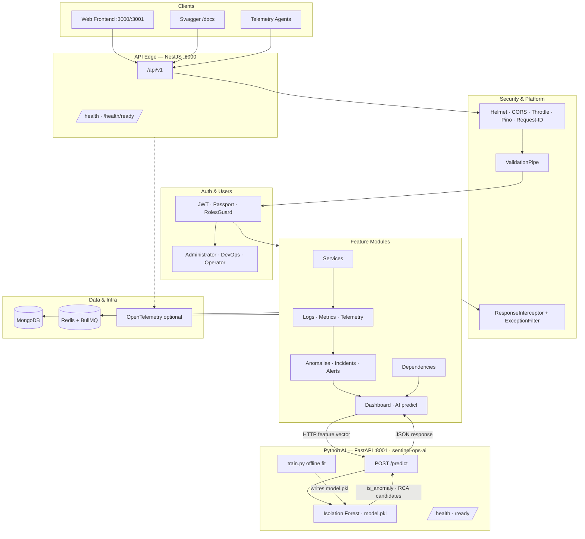
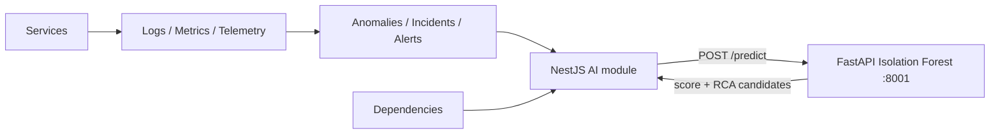
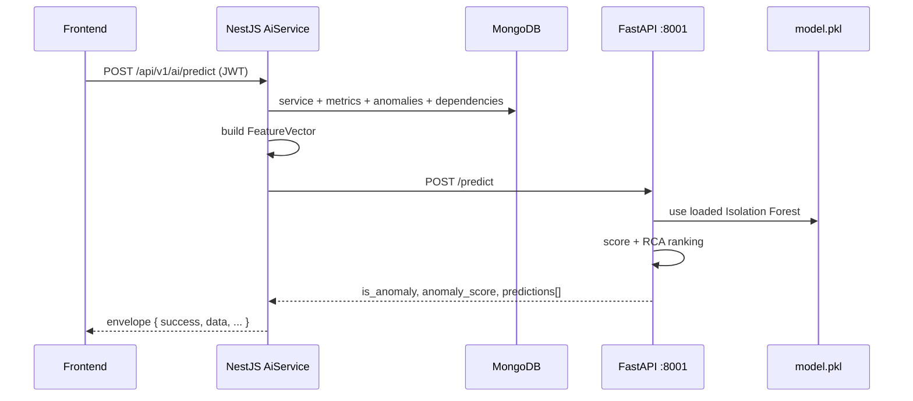

# SentinelOps Backend Architecture

AI-Based Incident Detection and Automated Root Cause Analysis Platform for Distributed Enterprise Applications.

| | |
|---|---|
| **API base** | `http://localhost:8000/api/v1` |
| **Swagger** | `http://localhost:8000/docs` |
| **AI service** | FastAPI Isolation Forest at `http://localhost:8001` (`sentinel-ops-ai`) |
| **Stack** | NestJS 11 · TypeScript · MongoDB · Redis · BullMQ · JWT · OpenTelemetry · FastAPI/sklearn |
| **Style** | Clean Architecture + DDD feature modules |

---

## 1. High-level system view

```text
┌─────────────────────────────────────────────────────────────┐
│  Clients                                                     │
│  Web Frontend (:3000 / :3001) · Swagger (/docs) · Agents     │
└────────────────────────────┬────────────────────────────────┘
                             │
                             ▼
┌─────────────────────────────────────────────────────────────┐
│  API Edge — NestJS (:8000)                                   │
│  Global prefix: /api/v1                                      │
│  Health: /health · /health/ready                             │
│  AI: POST /ai/predict ───────────────┐                       │
└────────────────────────────┬─────────┼───────────────────────┘
                             │         │
                             ▼         ▼
┌──────────────────────────────────┐ ┌─────────────────────────┐
│  Cross-Cutting Security          │ │  FastAPI AI (:8001)     │
│  Helmet · Compression · CORS     │ │  Isolation Forest       │
│  Throttler · Request-ID · Pino   │ │  POST /predict          │
│  JWT + Roles · ValidationPipe    │ │  GET /health            │
└────────────────────────────┬─────┘ └─────────────────────────┘
                             │
                             ▼
┌─────────────────────────────────────────────────────────────┐
│  Feature Domain Modules                                      │
│  Auth · Users · Services · Logs · Metrics · Telemetry        │
│  Anomalies · Incidents · Alerts · Dependencies               │
│  Dashboard · AI (HTTP client → FastAPI)                      │
└────────────────────────────┬────────────────────────────────┘
                             │
                             ▼
┌─────────────────────────────────────────────────────────────┐
│  Data & Infrastructure                                       │
│  MongoDB (Mongoose) · Redis + BullMQ · OpenTelemetry (opt.)  │
└─────────────────────────────────────────────────────────────┘
```

---

## 2. Mermaid — layered architecture



---

## 3. Domain data flow

Observability and topology feed detection; insights consume both for ops views and RCA.

```text
Services
   │
   ▼
Logs / Metrics / Telemetry
   │
   ▼
Anomalies / Incidents / Alerts
   │
   ▼
Dashboard + AI (POST /ai/predict) ──HTTP──► FastAPI Isolation Forest (:8001)
```



---

## 4. AI / Isolation Forest (Python service)

The ML path is a **separate microservice** at `~/Desktop/projects/miva/sentinel-ops-ai`, not embedded in NestJS or Next.js.

| | |
|---|---|
| **Repo / folder** | `../sentinel-ops-ai` |
| **Runtime** | Python 3.11–3.13 · FastAPI · Uvicorn · joblib |
| **Model** | `sklearn.ensemble.IsolationForest` (`sentinelops-isolation-forest-v1`) |
| **Artifact** | `model.pkl` (persisted; path via `MODEL_PATH`) |
| **Offline train** | `python train.py` |
| **Base URL** | `AI_SERVICE_URL` (default `http://localhost:8001`) |
| **Docs** | http://localhost:8001/docs |

### Three-app layout

```text
Next.js (:3000/:3001)  →  NestJS API (:8000)  →  FastAPI AI (:8001)
                               │                      │
                               └── MongoDB / Redis    └── model.pkl (Isolation Forest)
```

### Python project layout (`sentinel-ops-ai`)

```text
sentinel-ops-ai/
├── train.py                         # Offline: fit baseline → model.pkl
├── model.pkl                        # Persisted Isolation Forest (gitignored)
├── app/
│   ├── main.py                      # FastAPI app + lifespan (load model)
│   ├── config.py                    # PORT, MODEL_* hyperparams, MODEL_PATH
│   ├── routers/
│   │   ├── health.py                # GET /health, GET /ready
│   │   └── predict.py               # POST /predict
│   ├── schemas/predict.py           # FeatureVector, PredictRequest/Response
│   └── services/isolation_forest.py # train / load / score / RCA ranking
├── requirements.txt
├── Dockerfile
└── .env.example
```

### Training vs inference

| Step | Where | What happens |
|------|--------|--------------|
| **Train** | `python train.py` (or auto on first API boot) | Fit Isolation Forest on ~800 synthetic healthy samples → write `model.pkl` |
| **Load** | FastAPI lifespan | `load_or_train_model()` loads `model.pkl`; trains+saves if missing |
| **Predict** | Nest `POST /ai/predict` → AI `POST /predict` | Score feature vector; return `is_anomaly`, `anomaly_score`, ranked RCA candidates |
| **Retrain** | Re-run `train.py`, then **restart** FastAPI | Nest needs no code change |

### Predict sequence



If FastAPI is unreachable and `AI_FALLBACK_ENABLED=true`, Nest returns heuristic RCA (`mode: rule-based-fallback`).

### Feature vector (Nest → Python)

| Feature | Source (typical) |
|---------|------------------|
| `error_rate` | Metrics named `*error*` or `context.error_rate` |
| `latency_ms` | Metrics named `*latency*` or `context.latency_ms` |
| `cpu_pct` | Metrics named `*cpu*` |
| `memory_pct` | Metrics named `*memory*` |
| `anomaly_score` | Max related anomaly score |
| `dependency_risk` | Max criticality of related deps (`critical`→1 … `low`→0.2) |
| `log_error_count` | `context.log_error_count` (optional) |

### Python env (`sentinel-ops-ai/.env`)

| Variable | Default | Purpose |
|----------|---------|---------|
| `PORT` | `8001` | Bind port |
| `MODEL_CONTAMINATION` | `0.1` | Isolation Forest contamination |
| `MODEL_N_ESTIMATORS` | `100` | Number of trees |
| `MODEL_RANDOM_STATE` | `42` | Reproducibility |
| `MODEL_PATH` | `model.pkl` | Persisted model path |

### Nest env (AI)

| Variable | Default | Purpose |
|----------|---------|---------|
| `AI_SERVICE_URL` | `http://localhost:8001` | FastAPI base URL |
| `AI_SERVICE_TIMEOUT_MS` | `10000` | HTTP client timeout |
| `AI_FALLBACK_ENABLED` | `true` | Heuristic fallback when AI is down |

Full Python API contract: **`sentinel-ops-ai/README.md`**.

---

## 5. Request pipeline

Every HTTP request passes through this pipeline:

| Step | Stage | Components |
|------|--------|------------|
| 1 | Ingress | Helmet, compression, CORS, request-id middleware, Pino |
| 2 | Routing | Global prefix `/api/v1` + feature controllers |
| 3 | Guards | `ThrottlerGuard` → `JwtAuthGuard` → `RolesGuard` |
| 4 | Validation | Global `ValidationPipe` (`whitelist`, `forbidNonWhitelisted`, `transform`) |
| 5 | Application | Controller → Service → Repository (where used) |
| 6 | Response | `ResponseInterceptor` + `GlobalExceptionFilter` |

### Standard API envelope

```json
{
  "success": true,
  "message": "Success",
  "data": {},
  "timestamp": "2026-07-23T16:00:00.000Z",
  "requestId": "uuid"
}
```

---

## 6. Module map

| Module | Domain layer | Responsibility |
|--------|--------------|----------------|
| **Common** | Platform | Enums, DTOs, decorators, filters, interceptors, utils, health |
| **Config** | Platform | App, DB, JWT, Redis, throttler, OTEL, **AI** config namespaces |
| **Database** | Platform | MongoDB / Mongoose root connection |
| **Shared** | Platform | OTEL bootstrap and shared exports |
| **Auth** | Identity | Register, login, JWT strategy, global guards |
| **Users** | Identity | User CRUD, bcrypt hashing, roles |
| **Services** | Domain | Monitored service registry |
| **Logs** | Telemetry | Log ingest and query |
| **Metrics** | Telemetry | Metric datapoint ingest and query |
| **Telemetry** | Telemetry | Batch ingest of logs + metrics |
| **Anomalies** | Detection | Detected anomaly records |
| **Incidents** | Detection | Incident lifecycle including `PATCH /incidents/:id` |
| **Alerts** | Detection | Alert listing / status |
| **Dependencies** | Topology | Service dependency graph |
| **Dashboard** | Insights | Aggregated operational summary |
| **AI** | Insights | HTTP client to FastAPI Isolation Forest (`POST /ai/predict`) |

### Module conventions

Each feature module typically contains:

- `controller` — HTTP adapters only  
- `service` — business logic  
- `dto` — validated request/response shapes  
- `schema` — Mongoose schemas  
- `interface` — domain contracts  
- `repository` — persistence (when needed)  
- `*.spec.ts` — unit tests  

---

## 7. Authentication & authorization

```text
Client
  │  Authorization: Bearer <accessToken>
  ▼
JwtAuthGuard  ──@Public()──► skip auth (health, login, register)
  │
  ▼
RolesGuard    ──@Roles(...)──► enforce Administrator / DevOps / Operator
  │
  ▼
Controller / Service
```

| Role | Typical access |
|------|----------------|
| **Administrator** | Full management (users, services, configuration-sensitive ops) |
| **DevOps Engineer** | Operational write + read across monitoring domains |
| **Operator** | Read-heavy operational access; limited writes |

Password hashing uses **bcrypt**. Tokens are issued as access + refresh JWTs.

---

## 8. Key API surface

All routes are under `/api/v1` unless noted. JWT required except Public routes.

| Method | Path | Auth |
|--------|------|------|
| GET | `/health` | Public |
| GET | `/health/ready` | Public |
| POST | `/auth/register` | Public |
| POST | `/auth/login` | Public |
| GET | `/auth/me` | JWT |
| CRUD | `/users` | JWT + Roles |
| GET | `/dashboard` | JWT |
| GET / POST | `/services` | JWT |
| GET / POST | `/logs` | JWT |
| GET / POST | `/metrics` | JWT |
| GET / POST | `/anomalies` | JWT |
| GET / POST | `/incidents` | JWT |
| PATCH | `/incidents/:id` | JWT |
| GET | `/alerts` | JWT |
| GET | `/dependencies` | JWT |
| POST | `/telemetry` | JWT |
| POST | `/ai/predict` | JWT → FastAPI `:8001/predict` |

Swagger UI: `/docs` (not under the `/api/v1` prefix).

---

## 9. Data & infrastructure

### MongoDB collections

| Collection | Owner module |
|------------|--------------|
| `users` | Users |
| `services` | Services |
| `logs` | Logs |
| `metrics` | Metrics |
| `anomalies` | Anomalies |
| `incidents` | Incidents |
| `alerts` | Alerts |
| `dependencies` | Dependencies |

### Redis + BullMQ

Configured at application root for background job processing (detection / RCA workers can attach to this wiring).

### OpenTelemetry

Optional. When `OTEL_ENABLED=true`, bootstrap runs before Nest factory creation and registers NestJS instrumentation.

### Python AI service

Separate process; no direct Mongo access. NestJS is the sole orchestrator. See §4 and `sentinel-ops-ai/README.md`.

---

## 10. Project structure

```text
src/
├── auth/
├── users/
├── services/
├── logs/
├── metrics/
├── anomalies/
├── incidents/
├── alerts/
├── dependencies/
├── dashboard/
├── telemetry/
├── ai/                 # HttpModule client → FastAPI
├── common/
├── config/             # includes ai.config.ts
├── database/
├── shared/
├── app.module.ts
└── main.ts

# sibling repo
../sentinel-ops-ai/     # FastAPI + Isolation Forest
```

---

## 11. Design principles

1. **SOLID** — prefer small services, constructor injection, interface-driven contracts.  
2. **Thin controllers** — HTTP mapping and DTO binding only.  
3. **Domain in services** — orchestration and business rules.  
4. **Repository pattern** — isolate Mongoose access where complexity warrants it.  
5. **Fail safely** — global exception filter; production hides internal stacks; AI has optional heuristic fallback.  
6. **Observable by default** — request IDs, structured Pino logs, optional OTEL traces.  
7. **ML as a sidecar** — Isolation Forest lives in Python; Nest remains the API gateway.

---

## 12. Local run reference

```bash
# Terminal 1 — AI service
cd ../sentinel-ops-ai
source .venv/bin/activate
python train.py   # optional if model.pkl already exists
uvicorn app.main:app --reload --port 8001

# Terminal 2 — NestJS API
cd ../sentinel-ops-api
pnpm install
cp .env.example .env   # set MONGODB_URI, JWT, AI_SERVICE_URL=http://localhost:8001
pnpm start:dev
```

| Resource | URL |
|----------|-----|
| API | `http://localhost:8000/api/v1` |
| Health | `http://localhost:8000/api/v1/health` |
| Docs | `http://localhost:8000/docs` |
| AI service | `http://localhost:8001` |
| AI OpenAPI | `http://localhost:8001/docs` |

Frontend origins expected for CORS: `http://localhost:3000`, `http://localhost:3001` (and matching `127.0.0.1` variants as configured).
